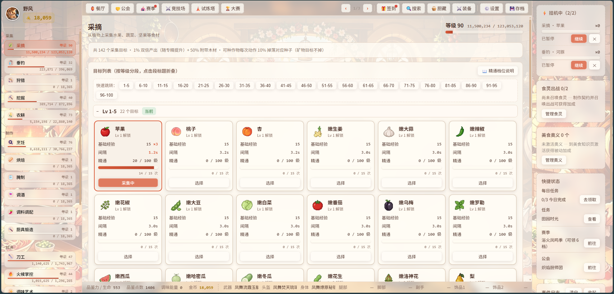

# 美食放置：食之契约（Culinary Idle: Taste Covenant）

**🕹 在线游玩：[https://xinysi.github.io/culinary-idle/](https://xinysi.github.io/culinary-idle/)**（GitHub Pages，打开即玩；Windows 桌面版见 [Releases 页](https://github.com/xinysi/culinary-idle/releases)）

Melvor Idle 风格的美食主题放置游戏。需求文档见 `美食放置：食之契约 — 游戏制作需求文档.md`。




## 环境说明

本机没有全局 npm，工具链已内置在 `.toolchain/node/`（Node v22.13.0 官方发行版，含 npm 10）。

```bash
# 安装依赖（首次）
npm.cmd install

# 启动开发服务器（默认 http://localhost:5173）
npm.cmd run dev

# 构建产物
npm.cmd run build

# 预览构建产物
npm.cmd run preview
```

> `npm.cmd` 是项目根下的包装脚本：它会先 `cd` 到项目目录再调用 `.toolchain\node\npm.cmd`（系统没有全局 npm，工具链已内置）。

## 目录结构

```
src/
├── main.js               # 入口：挂载 Vue + Pinia，启动游戏
├── App.vue               # 三栏布局（侧边栏 / 主区域 / 右侧面板，见需求文档 §9.1）
├── styles/main.css       # 主题变量（§9.2 配色）+ 布局 + 响应式（§9.3）
├── game/                 # 纯逻辑层（不依赖 Vue）
│   ├── core/
│   │   ├── Experience.js       # 经验曲线（§11.1，RuneScape 指数曲线）
│   │   ├── GameEngine.js       # 游戏主循环（§10.2.1，rAF + deltaTime）
│   │   ├── OfflineProgress.js  # 离线收益计算（§10.2.2，80% 效率 / 12h 上限）
│   │   ├── SaveManager.js      # 存档（§10.4，LocalStorage + JSON 导入导出，多存档位）
│   │   └── EventBus.js         # 事件总线
│   ├── data/
│   │   ├── items.js            # 物品数据库（§10.2.3 结构）
│   │   └── skills.js           # 20 技能注册表（§3）
│   ├── skills/
│   │   ├── Skill.js            # 技能基类（等级/经验/专精）
│   │   ├── GatheringSkill.js   # 采集类技能基类（定时产出 + 1% 双倍）
│   │   ├── ForagingSkill.js    # 采摘（§3.1.1，示例实现）
│   │   └── registry.js         # 技能实例注册表
│   └── bootstrap.js            # 启动流程：读档/离线结算 → 建技能 → 起循环
├── stores/
│   ├── player.js         # 玩家状态（§10.2.3：金币/技能/背包/装备/设置）
│   └── ui.js             # UI 运行时状态（日志/面板开关）
├── views/
│   ├── SkillView.vue        # 技能视图分派器（按技能类型分发）
│   ├── GatheringView.vue    # 采集类视图（采摘/垂钓/狩猎/挖掘）
│   ├── FarmingView.vue      # 农耕视图（农田/种植/收获）
│   ├── ProductionView.vue   # 制作类视图（食谱/材料/成功率）
│   └── ShopView.vue         # 杂货铺（种子/陷阱）
└── components/
    ├── Sidebar.vue       # 左侧技能导航（按类别分组，含等级经验条）
    ├── StatusPanel.vue   # 右侧面板（角色状态/快速背包/事件日志）
    └── ProgressBar.vue   # 通用进度条
```

## 与需求文档的对照

- 技能 id 与 §3 一一对应（foraging / fishing / hunting / excavation / farming / cooking / baking / preserving / brewing / spiceMixing / craftsmithing / knife / heatControl / flavorArtistry / plating / tasteAcumen / spiritSummoning / gastronomy / preservation / exploration）
- 背包/仓库使用 `{ itemId: quantity }` 对象形式（文档示例为数组 `[{id, quantity}]`），便于 Vue 响应式与查找，结构语义一致
- 存档当前存于 LocalStorage，`SaveManager` 接口预留 IndexedDB 切换点（§10.1 主存储为 IndexedDB，后续迭代）

## 当前可玩内容（里程碑 1-3）

**20 个技能全部注册**（§3.3 对决类与 §3.4 辅助类先用基类实例承载等级/经验，机制随后续里程碑实现）。

| 系统 | 文档 | 内容 |
| --- | --- | --- |
| 制作（6 技能） | §3.2 | 烹饪 234 食谱（含酱料入菜链）、烘焙（持续回血 + 能量饼干离线加成）、腌制（酱料 buff）、调酒（果汁/茶饮/酒类醉酒）、调料调配（含神秘调料）、厨具锻造（**20 品质套 + 同名矿 + 21 独立矿完整 8 槽套**，365 配方 / 244 装备） |
| 装备 | §5 | 8 槽位穿戴/卸下、属性合计、右侧面板装备栏、BOSS 传说/神话装备 |
| 料理对决 | §4 | 自动回合制、三角克制 +15%、3 风格（刀工/摆盘消耗装饰食材/调味消耗调味能量）、10 区域 20 对手 + 8 BOSS（灼烧/中毒/回血/降攻速/随机风格/秒杀/三阶段）、自动进食、酱料/饮品/神秘调料、战败丢装备 |
| 存档 | §8.2 | 3 存档位（保存/读取/删除）、JSON 导入导出、切后台自动存档、设置面板（自动进食/阈值）、**硬核模式**（死亡删档） |
| 背包/仓库 | §5.4 | **背包容量 20→100 格**（商店扩展）、**仓库 100→500 格**（背包↔仓库转移）、堆叠上限 9999、不可堆叠上限 1 |
| 出售 | §11.3 | 商店出售页签：按价值×0.5 回收金币（经济闭环） |
| 品质 | §5.2 | 六档品质齐全：普通/精良/稀有/**史诗**（水晶制）/传说/神话（装备 49 件） |
| 食灵召唤 | §3.3.6 | 160 种食灵（32 主题 × 5 阶级，1 级起可召唤；契约制作 = 召唤），2 个出战位；每阶级覆盖一个技能域（采耕/烹制/饮藏/御对/超凡），5 阶级合起来覆盖所有技能；被动：经验加成/流派伤害/每回合回血（灵芝）/伤害换代价（龙息）/垂钓成功率/农耕产量 |
| 美食知识 | §3.4.1 | 32 种奥义（攻击/防御/采集），品鉴点数（对决胜利获得）按秒消耗，激活后前 10 秒宽限免费试用，耗尽自动关闭；伤害/减伤/攻速/产量/经验加成 |
| 食材保鲜 | §3.4.2 | 保鲜剂/经验增益剂/产量增益剂各 5 阶级（Ⅰ~Ⅴ，共 15，lv 1~99 连续）+ 肥料 2；**保鲜被动**：保鲜技能等级越高腐坏越慢（每级 +2%，封顶 +100%）；lv≥25 荤食（海鲜/肉类/蛋）腐烂时长随等级 12+0.6×lv h（越高级越耐放），保鲜剂刷新；**冷库**可冻存腐坏食材（冻结倒计时，取出后从剩余时长继续），支持一键冻存全部，保鲜剂给冷库续时；默认 5 格，每次扩充 +1 格花 1000 金币，上限 100 格 |（§5.4）、保鲜剂刷新、经验/产量增益剂限时 buff |
| 美食探索 | §3.4.3 | 200 个目标（成功率+稀有战利品，失败损失金币/品鉴值；战利品按等级匹配全物品库，由 gen_exploration_targets.mjs 产出） |
| 成就图鉴 | §6 | 60+ 成就（技能 10/50/99 级 × 20 技能 + 对决/收集/探索/特殊）、图鉴完成度、收集奖励（渔夫之戒等 3 件）、称号系统 |
| 主线任务 | §7.2 | 13 个线性任务引导全流程（采集→农耕→垂钓→狩猎→挖掘→烹饪→烘焙→腌制→锻造→对决→BOSS→探索→全能），日志面板查看进度 |
| 转生 | §3 | 技能 99 级可转生：重置 1 级、永久 +20% 经验/层、等级上限突破至 120 |
| 餐厅经营 | §13 | 放置经营：菜单挂料理 → 每小时自动赚金币（离线 80% 效率），升级 +30% 收入/级 + 菜单位 |
| 公会 | §13 | 3 个公会（战斗/采集/制作被动），每日重置可重复任务赚公会点，公会商店兑换道具；换会 1000 金币点数减半 |
| 赛季 | §13 | **40 个赛季**按时间轮换（含扩展）；每季任务覆盖 采集/制作/对决/首领/餐厅收入 5 类（含任务「前往界面」跳转按钮），任务文案与物品获取方式同步，奖励档位含赛季限定装备 |
| 炼金 | §13 | 物品融合：全类别（食材/材料/加工品）按价值比融炼（投入≈产出换效率，高端需盐矿催化），装备已退出炼金；卡片展示可折叠、按产物类别分段 |
| UI | §9.3 | 全局毛玻璃质感：框（卡片/面板/列表）、弹窗、按钮、左/中/右导航栏均为半透明玻璃+模糊；左/右导航栏用启动页/自定义背景+白磨砂层；侧栏/顶部导航项透明毛玻璃+虚线分隔、未选中即显示；中间主内容区背景与启动页一致 |
| 竞技场 | §13 | 「其他玩家」镜像本地 PVP（真在线需后端，后续迭代）：10 名对手、连胜/最佳纪录排行榜 |
| 每日/周常任务 | 2026-09 | 每日 3 个任务（12 模板池按日期轮换，金币随对决等级放大）+ 全清礼包（能量饼干+金币）+ 连续天数🔥；每周 1 个大目标（8 模板，奖励翻倍档）；进度与主任务/赛季/公会同链 |
| 随机奇遇 | 2026-09 | 挂机动作 0.2% 概率触发（10 秒防抖）：8 个事件 × 3 选 1 分支，白给金币/材料 |
| 无尽挑战塔 | 2026-09 | **对决 99 解锁**：对手动态生成（opp() 先例，每 4 层 +1 级、属性逐层上浮，塔深无限）、每 10 层里程碑发奖、100 层厨神之路/130+ 轮回饕餮殿；对决页同款风格/属性组合框 + 完整对决框 |
| 月度厨艺大赛 | 2026-09 | 12 主题按月轮换（与 14 天赛季错峰）、每日 3 次提交料理（value+tier×5+heal×0.1 计分）、月分 1000/3000/6000 里程碑奖 |
| 转生里程碑 | 2026-09 | 转生 3/5/8/12 次成就（轮回行者/轮回大师/永恒轮回） |
| 食灵羁绊 | 2026-09 | 出战在线时长养成：2/6/12/20/30 天 → 1-5 级，每级该食灵效果 +4%（效果数据不动，玩家侧乘区） |
| 餐厅好感 | 2026-09 | 收入累积好感经验（500×L²/级，20 级封顶），每级小费 +3% |
| 图鉴里程碑 | 2026-09 | 图鉴 25/50/75/100% 成就（图鉴行家/宗师/美食全知者），成就总数 101 |
| 硬核挑战 | 2026-09 | 硬核生存天数（跨日 +1、死亡删档清空），1/7/30/100 天成就（硬核幸存者/硬核传说） |
| 图鉴卡牌化 | 2026-09 | 收集品卡牌化展示（稀有度配色）+ **3v3 卡牌对战**（重构为独立逻辑层+可单测）：战力统一量纲（档位15+回血+装备攻击×3+价值5%）、每局±12%浮动、AI 同池对称、**三档难度**（休闲/标准/挑战：AI×0.85/1/1.2，奖励×1/1.5/2.5）、每日首胜+50、首胜能量饼干、卡池管理（战力降序/搜索/料理装备筛选/13张每页/一键最强） |
| 小游戏 | 2026-09 | 🎮 小游戏大厅（顶部导航第三页单入口）：**🛒 游戏商店 + 七款游戏**统一「多模式分类 + 📖模式说明弹窗」；**2026-09-07 货币改革**：七款小游戏奖励全部改为**游戏币**（`player.gameCoins`，像素金币图标 `images/icon-coin.png`，与主金币分离），游戏商店为唯一消费口（货架候选建议 4 类 9 项待选定上架）——火候炉（**十模式**：新手宽区/慢火/经典/疾速/快燃/极限单轨 + 双锅同调/疾速/极限 + 精准单轨，速度·双轨·完美区宽参数化）、美食讲堂（**十模式**：知识入门/标准/大师、对比试炼/挑战、连线试炼/挑战、综合标准12题≥10/进阶15题≥13/大师18题≥16，达标得徽章+金币）、厨心 2048（**十模式**：3×3/4×4/5×5/6×6 × 出4率 5%/10%/30%/55%，标准合并/每步1新块/单次合并不级联，动画、图片制档位（8192+至高 262144 佛跳墙）、奖励×模式倍率、最佳分按模式独立）、大胃王（**十模式**：15s→300s 时长梯度，暴食×2、提前结算、累计金币无上限）、每日美食拼图（**十模式**：2×2~8×8 + 3/4/5×5 限步，图片与乱序每次随机、限步超步失败）、食材连连看（**十模式**：偶数棋盘 2×2/4×4/6×6/8×8/10×10 恰好填满无缺格 + 限时 60/90/120s、限步 16/30 步玩法变体，全清得金币）、**食材翻牌**（🧠 独立第七款：牌面 ❓ 记忆配对、3D 翻转/翻错抖动/消除缩放动画、翻错盖回，**十模式**：2×2/4×4/6×6/8×8/10×10 偶数棋盘 × 普通/限时/限翻，最佳=最少翻牌次数）；**2026-09-07 统一**：奖励全部金币（无 buff/饼干）、取消每日限制、按钮/文字/状态胶囊统一规范、图鉴物品图片固定尺寸（object-fit contain） |
| 食灵阁 | 2026-09 | **食灵不再占背包格**：召唤产物直接入独立食灵阁（`spirits.owned`），出战消耗/退役归还从阁中走；旧档背包食灵自动迁移；图鉴收集照常 |
| UI/移动端 | §9.3 | 技能 emoji 图标、卡片悬停动效、移动端底部导航 + 技能抽屉；**顶部导航分 3 页翻页**（‹ 页码 ›，右侧功能组固定贴右不随翻页移动） |
| 图鉴补全 | §3.2 | **配方全量 767 条**（烹饪 234/烘焙 37/腌制 30/调酒 47/调料调配 37/厨具锻造 365/食材保鲜 15+肥料 2，L1-99 覆盖）、**物品 2210**（含 400+ 采集材料/加工品、199 种子、52 同名/独立矿与锻造装备、160 食灵、15 保鲜/增益 5 阶级）；图鉴分类名全中文、物品「获取来源」点击跳转对应界面 |
| 觅珍抽卡 | 2026-09 | 5 个卡池（材料 60 金/食物 110/厨具 500/混池 80/限时 600），厨具 10 抽保底稀有+、限时 5 抽保底，单抽/十连/百连 + 模拟预览（不消耗金币）；**v0.5.0 池主题色 UI**：五池各配主题色（材料翡翠绿/美食橙黄/厨具钢蓝灰/混池紫/限时黑金），主题色贯穿池卡（顶部色条+选中渐变底+主题文字）→ 横幅（主题边框+顶条+保底徽章）→ 操作台（持有金币徽章/顶计统计卡）→ 三档抽卡按钮（十连最亮深彩字/单抽中间白字/百连最深金字，角度 135/120/105）→ 模拟按钮 → **翻牌卡（卡背中档渐变+主题光晕）**，切池整页联动换色；暗色模式全量适配（规则迁移至全局权威块后真正生效） |
| 制作队列 | 2026-09 | 制作类技能（烹饪/烘焙/锻造/保鲜/召唤等）**排队自动连续制作**：每 3 秒 1 份、相同配方合并、最多 8 项、材料不足自动暂停（补料后恢复）、清空/移除；队列随存档持久化 |
| 装备词条 | 2026-09 | 穿戴装备随机生成词条（普通 0-1/精良 1/稀有 1-2/史诗 2/传说 2-3/神话 3 条），8 类型（攻击/防御/命中/闪避/暴击/攻速/生命/金币%），数值取装备同属性为基准 ±50%（无基准按等级），换装重掷、脱下再穿同件保留；**洗练**按品质花费金币重随（400~30000）；词条并入装备属性面板与战斗结算（含 `gainGold` 金币乘区），不改动装备固定数值（数据铁律） |
| 食客订单 | 2026-09 | 餐厅接待食客点单：约 25-45 分钟到访（最多 3 单并行），从菜单点名料理 ×1-2，60 分钟有效（超时离开）；交付消耗成品料理得金币（按料理价值 ×1.5-2.2 × 等级加成）+ 好感经验；在线生成 |
| 配方导航树 | 2026-09 | 制作卡「🌳」按钮展开成品完整材料链（深度 ≤4、防环、数量乘算）：每个材料显示名称/数量/持有数/获取来源（图鉴索引），配方材料可「去做」直接跳转对应制作技能 |
| 一键入包 | 2026-09 | 背包/仓库弹窗「📤 一键入包」：仓库全部物品（含装备/食灵）一键移回厨藏，背包满自动跳过；与「📥 一键入仓」对称 |

## 发布（GitHub Releases）

- **自动发布**：推送 `v*` 标签即触发 `.github/workflows/release.yml`（GitHub Actions）：安装依赖 → `vite build` → Electron 桌面打包 → 创建 Release 并上传 Windows 可执行 zip。
  ```bash
  git tag v0.2.0 && git push origin v0.2.0
  ```
- **手动打包**（本机）：`npm.cmd run build` → 复制 `dist/` 到 `lmewexe/dist/` → `python lmewexe/fix_paths.py` → `cd lmewexe && npm run pack`（产物在 `lmewexe/release/`）。

## 内容扩充（生成器 expansion1.js 产出，勿手改）

- 采摘/垂钓/狩猎/挖掘 各 **+30 食材**（120 新采集物，等级 1-99 均匀分布）
- 烹饪 +30 食谱（共 80）、烘焙 +30（共 40）、腌制 +30（共 42）、调酒 +30（共 49）、调料调配 +30（共 45）
- 厨具锻造由生成器 `gen_smith_ores.mjs`（13 种同名矿）+ `gen_smith_sets.mjs`（20 品质套 + 21 独立矿完整 8 槽套）覆盖：**365 配方 / 244 装备**（勿手改产物 `smithOres.js`/`smithSetExt.js`）
- 食材保鲜改为 **3 系列 × 5 阶级**（保鲜剂/经验增益剂/产量增益剂 Ⅰ~Ⅴ，共 **15**，lv 1~99 连续，契约盐矿/稻米）+ 肥料 2；美食知识 **+10 奥义**（共 18）
- 美食探索 **+150 目标**（共 200，等级 1~99，战利品按等级带匹配全物品库，由 `gen_exploration_targets.mjs` 产出）、食灵召唤 **160 只**（32 主题 × 5 阶级：采耕/烹制/饮藏/御对/超凡）
- 对决：10 区域各 **+10 对手**（共 120）、**BOSS +10**（共 18，含独有掉落）
- 物品总数 **2224**；扩展物品由 `gen_expansion.mjs` 产出，锻造/农耕种子/同名矿/食灵阶级分别由 `gen_smith_sets.mjs` / `gen_farm_seeds.mjs` / `gen_smith_ores.mjs` / `gen_spirit_tiers.mjs` 产出（勿手改产物）

## 数值平衡（Beta→Release 调优）

- **对决等级门控**：区域/BOSS 解锁由「品鉴力等级」改为 Melvor 式**对决等级** =（品鉴力+最高攻击技能+火候）/3，三技能同步成长（修复原设计品鉴力单点瓶颈：25 级需近千场的断裂曲线）
- **对决经验重调**：击杀经验超线性缩放（品鉴 `12L+0.3L²`、攻击 `10L+0.25L²`、火候 `7L+0.2L²`），命中/受击附加上经验；对决类技能 75 级后 +5%/级加速（RS 曲线尾段补偿）
- **验证**（`balance_sim.mjs` 真实引擎模拟）：解锁节奏 对决10→25场、25→51场、40→128场、55→477场、75→3277场、85→7491场、90→10955场；推荐等级对局胜率（进食）≈100%；战败率 <0.3%
- 99 级对决保留为端局（配合转生/增益剂/食灵可进一步提速）
- 其他修复：99 级经验钳制、图鉴完成度一位小数、公会任务按本地日期重置、负数金币/物品防护、探索离线金币入账；觅珍页暗色模式 21 条规则修复（组件内 `:global` 写法从未编译生效，迁移至 main.css `html[data-theme='dark']` 全局块）；**图鉴全物品审计**（16 组物品重名去重、主菜/甜点/汤品/主食类别标签补全、62 条炼金幽灵配方从 UI/图鉴过滤）；**newGame/存档加载重置根治**（defaultState 单一工厂，嵌套字段不再残留漂移）；品鉴力数值统一两位小数

数值说明：垂钓/狩猎/挖掘的 XP/间隔为按文档解锁等级对齐的同档位设计值（文档未给出具体数值）；烹饪食谱材料均来自当前可获取的食材；对决属性按 §11.2 公式，区域对手与 BOSS 数值为按推荐等级设计的档位。

| 技能 | 文档 | 机制 |
| --- | --- | --- |
| 采摘 | §3.1.1 | 142 种食材（核心+扩展+嫩替代），1% 双倍（随专精提升）+ 50% 附带木材 + 10% 掉种子 |
| 垂钓 | §3.1.2 | 12 种鱼，成功率（55% 基础 + 等级差），失败 20% 经验，0.5% 稀有金龙鱼 |
| 狩猎 | §3.1.3 | 10 种猎物，每次消耗 1 陷阱（杂货铺购买），野鸡 15% 掉蛋 |
| 挖掘 | §3.1.4 | 83 种挖掘物（含 13 同名矿 + 21 独立矿），2% 化石食材 + 50% 铜矿 + 30% 铁矿 + 10% 掉种子 |
| 农耕 | §3.1.5 | 199 种作物（15 手写 + 184 种子扩充），4→12 地块（每 10 级 +1），3% 枯萎，时间戳生长天然支持离线；种子由采摘/挖掘 10% 掉落 + 杂货铺/珍馐阁购买 |
| 烹饪 | §3.2.1 | 13 个食谱（L1-85），失败消耗材料给半额经验 |
| 杂货铺 | §11.3 | 出售 199 种子 + 弹药/肥料/调酒原料/容量扩展（共 207 条）；珍馐阁按食物/种子/道具分类售卖，商店含 type tab 分类 + 搜索 |

数值说明：垂钓/狩猎/挖掘的 XP/间隔为按文档解锁等级对齐的同档位设计值（文档未给出具体数值）；烹饪食谱材料均来自当前可获取的食材。

## 许可证

本项目采用 [GPL-3.0](LICENSE)：你可以自由使用、修改、分发本项目（含商用），但**衍生作品必须同样以 GPL-3.0 开源**。

Copyright (C) 2026 xinysi
